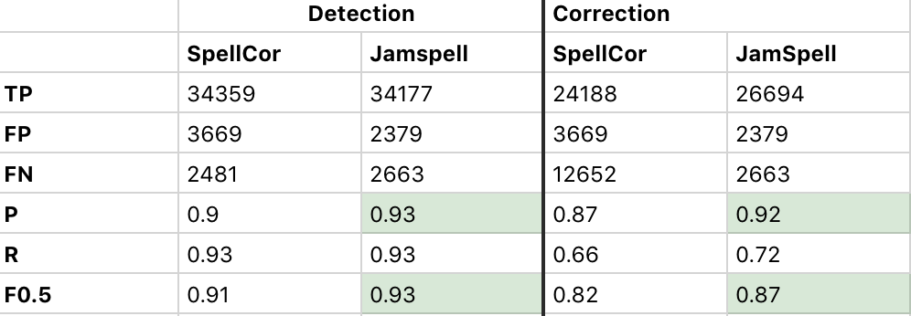

# SpellCor

**SpellCor** is a spell correction tools coded fully with PYTHON.

We implement this program inspired by [*JamSpell*](https://github.com/bakwc/JamSpell) which writen in C++ and could used with python by swig. 
**Jamspell** is effective due to **C++** benefits. However, it's not convenient for developers or anyone who 
wants to add some features to it. Considering the prevalence of python in NLP area, We implement a python
version spell correction program works like **Jamspell**, we call it **SpellCor**.

Compare with **Jamspell**, **SpellCor** is more flexible for Python developer:
* Fully python code, include a python version *n-gram* language model .
* You can easily use your own language model like NN models by writing some pieces of code.
* Support to filter candidate words by the dictionary pointed by yourself.

We also evaluate both **SpellCor** and **Jamspell** on *2W+ sentences* contain spell errors, below is the detail.
SpellCor's performance is a little bad, but that maybe because we use a basic n-gram language model and the performance
can be improved if you use NN language model.
 
</img>

***

### Requires

> python 3.x

### Basic Usage

#### Installation

```shell
pip install spellcor
```


#### load language model

You can *download* basic language model [here](https://pan.baidu.com/s/1zfIdfTJvEn2x1CtFTmfD2Q)

```python
import spellcor

checker = spellcor.SpellChecker()

# show all language model we supported
checker.show_show_lang_models()

> ["BaseLanguageModel"] #  the default one

# load language model
model_name = "BaseLanguageModel"
model_path = "./tmp/nglm.bin"
checker.load_lang_model(model_name,model_path)
> Loading...
> Load Success!

```
#### sentence correction

```python
checker.fix_sentence("here are some Questino , I am pyspell checkre ")

>  here are some Question , I am spell checker
```

#### fix by position

```python
checker.fix_pos(["here","are", "some", "Questino"], 3)
> ['Question', 'Questino']

```
---
### Extension 

#### Add language model

* **Add** your own model
 
 creat a py file and Add a new class based on `AbstractLanguageModel` like this:
```python
import spellcor

@spellcor.register_lang_model("NewModel")
class MyModel(spellcor.AbstractLanguageModel):
    def __init__(self, model_path, **kwargs):
        super(MyModel, self).__init__("NewModel")
        self.language_model = None
        self.load_lang_model(model_path)

    def get_score(self, sentence, word_start_index, word_end_index):
        pass

    def is_word(self, word):
        return self.language_model.is_word(word)

    def load_lang_model(self, model_path):
        pass

    def word_freq(self, word):
        pass
```
These four methods above **must** be implemented in your new class.

* Check model list and use

```python
# Do not forget import your new .py

checker = spellcor.SpellChecker()

checker.show_show_lang_models()

> ["BaseLanguageModel","NewModel"] 

checker.load_lang_model("NewModel",model_path)
```

#### Judge input token whether a real word with your Own dictionary
Like **JamSpell**, **SpellCor** also gives words' candidates a different penalty according to original input is a real word 
or not. In **JamSpell**, it judges a input token whether a word by searching it in the language model. However, the corpus used
training the language model is always dirty, *so it may "trust" wrong words and give their candidates a larger penalty.*
By defining your own clean dictionary, this problem can be solved.
```python
# load a clean dictionary
checker.load_valid_word_dict(dict_path)
```
By default, once you load the dictionary, SpellCor will use it automatically. If you want to "close" this dictionary, 
call below function:
```python
checker.use_valid_word_dict = False
```

#### Judge candidate word with your Own dictionary

It is exactly as same as input token part.

```python
# load a clean dictionary
checker.load_valid_candidate_dict(dict_path)
```

 Close it!
```python

checker.use_valid_candidate_dict = False

# open it 
checker.use_valid_candidate_dict = True

```

### TO-Do

1. Add **symmetrical deletion algorithm**.
2. Add NN language Model.

### License

> Under MIT license

Any code commitment or review is Welcome!
